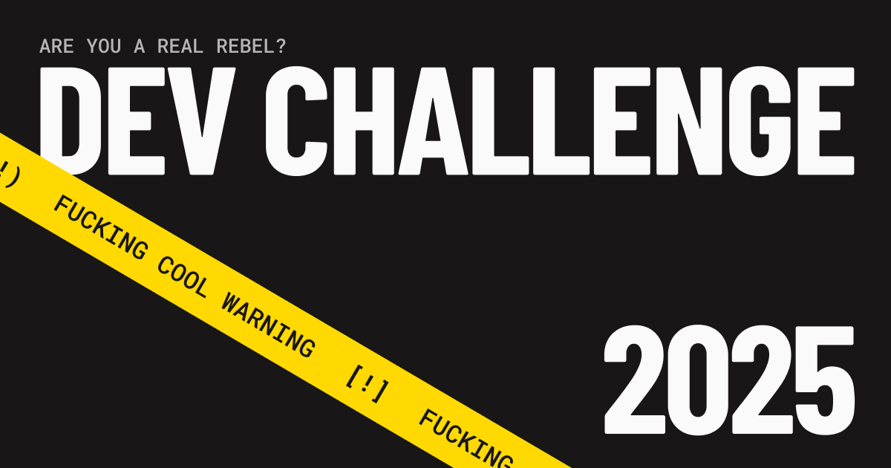

# &nbsp;&nbsp;JOYCO Dev Challenge

Ready to show us what you've got?

This is JOYCO’s official dev challenge — a playground for you to flex your frontend skills and push some pixels with purpose.

---

## Challenge Scope

**Figma**: [JOYCO Dev Challenge](<https://www.figma.com/design/yIttBU3vUZilw0OCqsENde/(JOYCO)-Dev-challenge>)
 
**Basehub**: [Public Repo](https://basehub.com/joyco/2025-dev-challenge)

What we’re looking for:

- ♻️ **ISR (Incremental Static Regeneration)**
- 🌐 **Basehub integration** for dynamic content
- 🧩 **Form**:
  - Full implementation
  - Schema-based validation (we left a schema ready to use)
  - Proper error handling with clear feedback

> ✍️ We already left the form schema and submission endpoint ready to plug in — no need to overthink the backend. Just wire it up and style it your way.

- 🔍 **Pixel-perfect** design match
- 📱 **Responsive layouts** for mobile, tablet, and desktop
- 🖼️ **Retina-ready images** (2x)
- 🎭 **Custom interactions or animations**  
  (Framer Motion, GSAP — up to you)

---

## Nice-to-haves

We love when people go the extra mile. Things that’ll make us go “damn”:

- 🍭 Easter eggs
- ✨ Micro-interactions
- 📦 Creative use of UI libraries
- 🧠 Smart UX touches
- 🌀 Custom transitions or hover states
- 🛠️ Your own creative spin on how things feel or move

---

## Docs & Resources

- 📚 [Basehub Docs](https://docs.basehub.com/introduction)
- 🧰 [Basehub Templates & Examples](https://docs.basehub.com/templates-and-examples/templates/introduction)

---

## Tech Suggestions

Use whatever stack makes you shine. That said, we vibe with:

- `tailwindcss`
- `shadcn/ui`
- `react-hook-form`
- Any of the JOYCO open source goodies

---

## Final Notes

This isn’t just a test — it’s a chance to show your taste, your thinking, and your love for clean, creative frontend.

Make it smart. Make it smooth.  
And above all… **make it yours.**

**Have fun.**  
Made by rebels.
